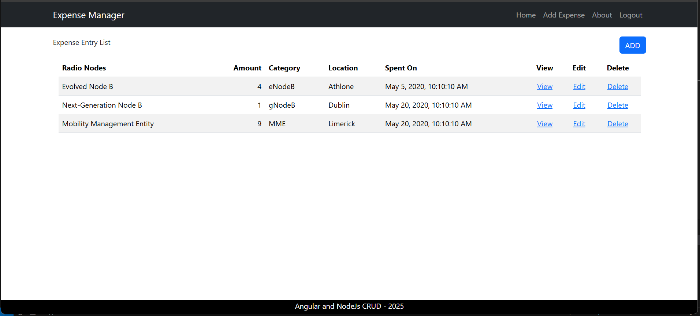

# Expense Manager

A modern, full-stack CRUD application for tracking and managing expenses, built with **Angular 19** and **Node.js**. This project demonstrates the implementation of modern Angular best practices and architectural patterns.



## 🚀 Features

- **Complete CRUD Operations**: Create, Read, Update, and Delete expense entries.
- **Authentication**: Secure login and logout functionality (Mock implementation).
- **Expense Categorization**: Organize expenses by categories for better tracking.
- **Responsive Design**: Built with Bootstrap 5 for a seamless experience across devices.
- **Server-Side Rendering (SSR)**: Optimized for performance and SEO using Angular SSR.
- **Lazy Loading**: Optimized initial load time by lazy loading all route components.

## 🛠️ Technology Stack

- **Frontend**: Angular 19 (Standalone Components)
- **Styling**: Bootstrap 5.3
- **State Management**: Angular Signals & RxJS
- **Backend**: Node.js with Express (Mock Server)
- **Build Tool**: Angular CLI

## 🏗️ Architecture & Best Practices

This project adheres to strict Angular best practices:

- **Standalone Components**: Fully modular architecture without `NgModule`.
- **Lazy Loading**: All routes are lazy-loaded to improve performance.
- **Path Aliases**: Clean imports using `@app/*` and `@env/*` aliases.
- **Environment Configuration**: Separate configurations for Development and Production.
- **Strict Typing**: Comprehensive TypeScript typing for reliability.
- **Guard Protection**: Route guards to protect authenticated routes.

## 📂 Project Structure

```
expense-manager/
├── src/
│   ├── app/                 # Angular application source
│   │   ├── expense-entry/   # Feature components
│   │   ├── shared/          # Shared services and guards
│   │   └── ...
│   ├── environments/        # Environment configurations
│   └── assets/              # Static assets
├── MockServer.js            # Mock backend server
├── angular.json             # Angular workspace configuration
└── package.json             # Dependencies and scripts
```

## 🚦 Getting Started

### Prerequisites

- Node.js (Latest LTS or v20.10.0 recommended)
- Angular CLI (`npm install -g @angular/cli`)

### Installation

1. Clone the repository:
   ```bash
   git clone <repository-url>
   ```
2. Install dependencies:
   ```bash
   npm install
   ```

## 🔌 Backend Setup (Mock Server)

To ensure the application works correctly, you need to run the mock backend server.

### 🖥️ Running the Mock Server

To ensure the application works correctly, you need to run the included mock backend server (`MockServer.js`). Follow these steps:

1. Check Your Node.js Version
   Make sure you have Node.js v20.10.0 (or a compatible LTS version) installed:
   ```
   node -v
   ```
   ✅ You should see `v20.10.0` or a similar compatible version.

2. **Navigate to the Project Directory**  
   Open your terminal and go to the root folder of the project (where `MockServer.js` is located).

3. **Install Server Dependencies**  
   The mock server uses Express. Install it by running:
   ```
   npm install express
   ```

4. **Start the Mock Server**  
   Launch the server with the appropriate command for your operating system:
   ```
   # Windows / Standard terminals
   node MockServer.js

   # Linux / macOS (standard usage—no ./node prefix needed)
   node MockServer.js
   ```

5. **Verify the Server Is Running**  
   Once started, the server will be available at:  
   🔗 [http://localhost:8000](http://localhost:8000)  
   
   You can open this URL in your browser or test the API using tools like **Postman** or **curl**.

> 💡 Keep the mock server running in the background while developing or using the Angular frontend!
 
## ▶️ Running the Frontend

Once the backend is running:
 
1. Start the Angular Application:
  ```
   ng serve
   ```
2. **Access the App**:
   Navigate to `http://localhost:4200/`. The application will automatically reload if you change any of the source files.

## 🧪 Testing

### Unit Tests
Run unit tests via [Karma](https://karma-runner.github.io):
```bash
ng test
```

### Build
Build the project for production:
```bash
ng build
```
The build artifacts will be stored in the `dist/` directory.

## 📜 License & Copyright

© Raul Lopes. All rights reserved. Built for portfolio and educational purposes.


